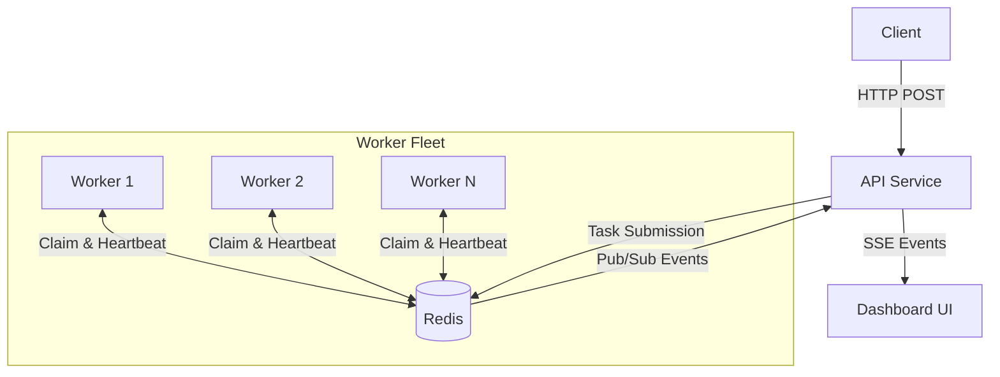
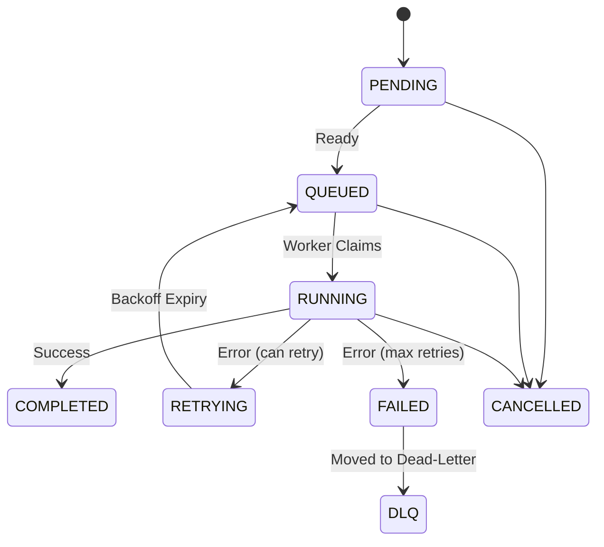

# TaskStorm

> Distributed Task Execution Platform

A production-quality distributed task execution system built from scratch using Python, FastAPI, Redis, and React. Tasks are submitted via REST API, queued in Redis, and executed concurrently by independently scalable worker processes.

Designed to demonstrate understanding of distributed systems concepts: at-least-once delivery, lease-based ownership, atomic coordination via Lua scripts, failure detection, and recovery.

## Architecture



- **API Service**: Stateless FastAPI app. Task submission, state queries, SSE events.
- **Worker Service**: Independent processes claiming tasks atomically from Redis.
- **Redis**: Message broker, state store, coordination layer, event bus.
- **Dashboard**: React/TypeScript real-time monitoring UI.

## Task Lifecycle



Every state transition is enforced by a validator. Illegal transitions are rejected.

## Key Design Decisions

| Decision | Rationale |
|----------|----------|
| at-least-once delivery | Exactly-once requires distributed transactions. We use idempotent handlers instead. |
| Lua scripts for atomicity | Redis Lua scripts execute atomically, eliminating TOCTOU races in claim/complete/fail. |
| Lease-based ownership | Prevents stale workers from corrupting task state after their lease expires. |
| Separated heartbeats & leases | Heartbeats = worker liveness. Leases = task ownership. Independent concerns. |
| Sorted set priority queue | O(log N) insertion/extraction with encoded priority + FIFO tiebreaking. |
| SSE over WebSockets | Simpler, auto-reconnect, sufficient for unidirectional monitoring. |
| Predefined task types only | Security: no arbitrary code execution from user input. |

## Features

### Core
- Asynchronous task execution with configurable worker concurrency
- Redis-backed priority queues (priority 1-10, FIFO within same priority)
- Delayed/scheduled task execution
- Configurable retries with exponential backoff + jitter
- Dead-letter queue for exhausted tasks
- Atomic idempotent task submission
- Worker heartbeats with health detection (HEALTHY → UNHEALTHY → OFFLINE)
- Task leases with renewal and stale-worker rejection
- Automatic failure detection and task recovery
- Persistent task state with complete history

### Observability
- Real-time Server-Sent Events stream
- Structured JSON logging
- System metrics (throughput, latency percentiles, queue depth)
- Worker utilization tracking

### Dashboard
- Real-time overview with live event feed
- Task explorer with filtering, search, pagination
- Task detail with state history timeline
- Worker fleet monitoring
- Metrics visualization
- Queue depth and priority breakdown
- Failure simulation controls

## Delivery Semantics

**at-least-once delivery + idempotent processing**

We do NOT claim exactly-once execution. Duplicate execution is possible when:
- Worker crashes after execution but before acknowledgement
- Lease expires while worker is still running
- Network partition prevents acknowledgement

Task handlers must be idempotent. See [docs/failure-modes.md](docs/failure-modes.md) for detailed analysis.

## Redis Data Model

All keys prefixed with `ts:`. Key structures:

| Key Pattern | Type | Purpose |
|-------------|------|--------|
| `ts:task:{id}` | Hash | Task state and metadata |
| `ts:queue:priority` | Sorted Set | Priority queue (score = priority × 1e12 + timestamp) |
| `ts:queue:scheduled` | Sorted Set | Delayed tasks (score = scheduled_at) |
| `ts:queue:retry` | Sorted Set | Retry backoff queue (score = next_retry_at) |
| `ts:lease:{task_id}` | String+TTL | Lease ownership token |
| `ts:worker:{id}` | Hash | Worker registration and stats |
| `ts:active_tasks` | Set | Currently executing tasks |
| `ts:dlq` | List | Dead-letter queue |
| `ts:idempotency:{key}` | String+TTL | Idempotency deduplication |
| `ts:events` | Pub/Sub | Real-time event distribution |

See [docs/redis-data-model.md](docs/redis-data-model.md) for complete documentation.

## API

| Method | Endpoint | Description |
|--------|----------|------------|
| POST | /api/v1/tasks | Create task |
| GET | /api/v1/tasks | List tasks (filter by status, paginate) |
| GET | /api/v1/tasks/{id} | Get task detail |
| POST | /api/v1/tasks/{id}/cancel | Cancel task |
| POST | /api/v1/tasks/{id}/retry | Retry failed/DLQ task |
| GET | /api/v1/tasks/dlq | List dead-letter queue |
| GET | /api/v1/workers | List workers |
| GET | /api/v1/metrics | System metrics |
| GET | /api/v1/events | SSE event stream |
| GET | /health | Health check |
| GET | /live | Liveness probe |
| GET | /ready | Readiness probe |

## Task Types

| Type | Description | Purpose |
|------|------------|--------|
| `sleep` | Async sleep for N seconds | Test basic execution |
| `cpu_simulation` | CPU-bound work in executor | Test CPU workloads |
| `random_failure` | Fail with configurable probability | Test retry mechanisms |
| `deterministic_failure` | Always fails | Test DLQ flow |
| `lease_expiration` | Runs longer than lease duration | Test lease recovery |
| `eventual_success` | Fails N times then succeeds | Test retry lifecycle |

## Quick Start

### Docker (recommended)
```bash
git clone <repo>
cd taskstorm

# Start all services (API + 2 workers + Redis + Dashboard)
docker compose up --build

# Scale workers
docker compose up --scale worker=4
```

- API: http://localhost:8000
- Dashboard: http://localhost:3000
- API Docs: http://localhost:8000/docs

### Local Development
```bash
# Start Redis
docker run -d -p 6379:6379 redis:7-alpine

# Backend
cd backend
python -m venv .venv
source .venv/bin/activate
pip install -r requirements.txt
uvicorn app.main:app --reload --port 8000

# Worker (separate terminal)
cd backend
source .venv/bin/activate
python -m app.workers.entry

# Frontend (separate terminal)
cd frontend
npm install
npm run dev
```

## Testing

```bash
cd backend
pip install -r requirements.txt  # includes test deps
pytest tests/ -v

# Specific test categories
pytest tests/unit/ -v          # Unit tests
pytest tests/integration/ -v   # Redis integration tests
pytest tests/concurrency/ -v   # Race condition tests
```

### Key Test Scenarios
- **Concurrent claim**: 10 workers claim 1 task → exactly 1 owner
- **Stale worker rejection**: Expired lease → completion rejected
- **Concurrent idempotency**: 20 concurrent submissions → 1 task
- **Lease expiry recovery**: Lease expires → task recovered and re-claimed

## Failure Simulation

```bash
# Generate load
python scripts/generate_load.py --count 100 --task-type sleep

# Trigger lease expiry recovery
python scripts/fail_worker.py --count 5

# Monitor heartbeat status
python scripts/fail_heartbeat.py

# Run recovery test suite
python scripts/test_recovery.py

# Benchmark
python scripts/benchmark.py --tasks 200
```

## Project Structure

```text
taskstorm/
├── backend/
│   ├── app/
│   │   ├── api/          # FastAPI route handlers
│   │   ├── core/         # Config, Redis, logging
│   │   ├── models/       # Pydantic models
│   │   ├── queue/        # Task queue, Lua scripts, state management
│   │   ├── workers/      # Worker runtime, handlers, heartbeat, lease
│   │   ├── scheduler/    # Scheduled task promotion
│   │   ├── recovery/     # Stale worker detection, task recovery
│   │   ├── events/       # Event publishing (Pub/Sub)
│   │   └── metrics/      # Metrics collection
│   └── tests/            # Unit, integration, concurrency tests
├── frontend/src/
│   ├── components/       # Reusable UI components
│   ├── pages/            # Dashboard pages
│   ├── hooks/            # SSE, polling hooks
│   ├── services/         # API client
│   └── types/            # TypeScript interfaces
├── scripts/              # Failure injection, load testing, benchmarks
├── docs/                 # Architecture, Redis model, failure modes, ADRs
└── docker/               # Dockerfiles, nginx config
```

## Documentation

- [Architecture](docs/architecture.md) — System design, state machine, consistency model
- [Redis Data Model](docs/redis-data-model.md) — Key structures, Lua scripts, race condition prevention
- [Failure Modes](docs/failure-modes.md) — 14 failure scenarios with detection and recovery
- [Architectural Decisions](docs/decisions.md) — 12 ADRs with rationale and tradeoffs

## Limitations

- Single Redis instance (no cluster/sentinel)
- No persistent storage beyond Redis (task history lost if Redis data lost)
- CPU-bound tasks block the asyncio event loop (documented; use multiple worker processes)
- No authentication/authorization (not in scope)
- Priority aging is best-effort under sustained high load
- Single API instance runs scheduler and recovery (could be separated for HA)

## Future Work

- Redis Cluster support for horizontal scaling
- PostgreSQL for durable task history
- Task dependency DAGs
- Rate limiting per task type
- Worker auto-scaling based on queue depth
- Authentication and multi-tenancy
- Prometheus metrics endpoint
- Task timeout enforcement

---

Built with Python 3.12, FastAPI, Redis, React, TypeScript, and Docker.
